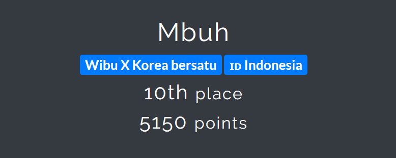

# Write UP CTF FIRST Challenge 2020 (Network Category)


Assalamualaikum warahmatullahi wabarakatuh. Sudah lama tidak menulis tentang Write UP CTF.  Ceritanya salah satu sahabat saya `@aiemruut` share link CTF di Group Surabaya Hacker Link. Karena saya gabut dan tidak pernah main CTF lagi, saya memutuskan membuat team dengan Adik-adik saya yang overpower `@kosongblong` dan `@colorlesss`. Ya saya bilang ke mereka berdua untuk di`gendong` selama CTF, karena 2 hari CTF itu, saya ada Exam 2 kali juga yang satu `****` dan `****` 😭😭. Jadi sejujurnya di CTF ini saya cukup `useless`. At all team kami finish di urutan ke 10 dari 278 peserta. Terima kasih Ayik dan Dim-Dim kun.





Jadi untuk Write UP kali ini saya fokuskan ke kategori `Networking` karena soal soalnya cukup related dengan soal Exam saya *Cough.  Sayangnya juga CTF ini tidak ada kategori `Web` nya huft. Semua resource soal berada pada folder `src`.


## Compromise - part 1

Diberikan sebuah file `pcap` bisa didownload di folder `src`.  Soalnya akan digunakan sampai part 9

Question :  What is the attacker IP address?

Buka file `pcap` nya lalu apply filter `ip.src` lihat baris pertama 

flagnya = `172.16.100.223`


## Compromise - part 2

Question :  What is the victim IP address?

Buka file `pcap` nya lalu apply filter `ip.src` lihat baris pertama lalu lihat bagian destination.

flagnya = `172.16.100.1`


## Compromise - part 3


Question : What is the service exploited? (brandname/servicename/portnumber) 

Soal ini sebenernya mudah, saya dan `@colorlesss` cukup kebingunan untuk mendapatkan format flag yang benar, Pertama `@colorlesss`  sudah mengira bahwa ini Brandnamenya adalah `Mikrotik` tapi dengan service yang salah, Akhrinya kami berdua melakukan brute force flag dengan service `SSH` dengan port `22`. Karena kami juga menemukan exploitnya di exploit-db.


Lalu ternyata memang simple, Kami menemukan brand Mikrotik di akhir package dan baru sadar ada port `8291` 

Flagnya = `Mikrotik/Winbox/8291` 


8291 adalah port untuk exploit Winbox yang kemarin hype.


## Compromise - part 4

Question : What is the CVE number for this vulnerability? (CVE-YEAR-NUMBER)

Tinggal searching CVE untuk Winbox ini.

Flagnya = `CVE-2018-14847` 


## Compromise - part 5

Question : What is the username found?


Karena mencari username tinggal memfokuskan ke port `8291` apply filter `tcp.port == 8291` 

Lalu cari paket yang mempunyai `Data` yang `besar` -> `follow TCP Stream` 

cari paket (no 12) yang melakukan localfileread `.!(//./.././.././../flash/rw/store/user.dat` 


flags = `masterofmasters`


## Compromise - part 6

Question : What is the password found?


Sama dengan soal nomer 5. Caranya adalah `Save as Raw Binary` paket nomer `12`.


Download exploit winbox bagian extract data.


`curl https://raw.githubusercontent.com/BasuCert/WinboxPoC/master/extract_user.py > extract.py` 


Modify bagian `__main__` 

```python
    # if len(sys.argv) == 2:
    #     if sys.argv[1] == "-":
    #         user_file = sys.stdin.buffer.read()
    #     else:
    #         user_file = open(sys.argv[1], "rb").read()
    user_file = open('dumped.txt', "rb").read()
    dump(user_file)
         
    # else:
    #     print("Usage:")
    #     print("\tFrom file: \t", sys.argv[0], "user.dat")
    #     print("\tFrom stdin:\t", sys.argv[0], "-")
```

Menjadi seperti berikut agar simple aja.


Flagnya : `GtV453&Ol` 


## Compromise - part 7

Question : What is the key used to encrypt the password?

awalnya say mengira key yang dimaksud 

```python
>>import hashlib
>>e = lambda x : hashlib.md5(x + b"283i4jfkai3389").hexdigest() 
>>e('masterofmasters')
'b552ed5093db0dd8b7f5c132280d6679'                                    
```


Ternyata cuman user+283i4jfkai3389


Flagnya = `masterofmasters+283i4jfkai3389`


## Compromise - part 8

Question : What is the service used by the attacker to connect to device?


Karena cukup banyak service `ssh` terbuka maka emang `ssh` yang paling memungkinkan untuk konek ke sebuah device


Flagnya = ssh


## Compromise - part 9

Question : Which service/port was started on the device? (protocol/port)


Di clue disebutkan bukan `well known port` jadi bukan `ssh,winbox` yang telah diidentifikasi sebelumnya. Setelah melakukan geussing cukup lama, ditemukan port lain seperti 4545 yang bukan well known, dan service untuk port itu kemungkinan adalah proxy/socks. 


Flagnya = socks/4545

## Compromise - part 10

Question : There is one more flag here. Can you find that?


Diberikan satu tambahan pcap lagi terdapat di `src/10.pcap`


Buka file `10.pcap` cari Key dumping


Lalu contoh tutorial decrypt SSL berikut ini

https://developer.mozilla.org/en-US/docs/Mozilla/Projects/NSS/Key_Log_Format


Pada bagian tutorial di atas, jika mencari SSL menu tidak ada, Diganti menjadi TLS


Buka file `1-9.pcap` lagi lalu apply filter `http2`


Lalu follow TLS stream pada first paket yang telah terfilter, Lihat pada bagian title.


Flagnya : 2fb0ff51a1180f35be9b786821457e8bd4e5


## A network traffic

Question : Can you find the flag?


Diberikan satu file `cap2.pcap` yang bisa diunduh di folder `src` , Kami belum pernah menemukan kasus seperti ini, dan mendapatkan cara simple dengan menggunakan `strings`. Terdapat morse code lalu decode saja.


```sh
$ strings cap2.pcap                  ps5                                                                                      ps4:                                                                                     -- --- .-. ... . / -.-. --- -.. . / - .... . / ..-. .-.. .- --. / .. ... / .---- ..-. .---- ----. ----- ----. ----- ..... ...-- -.-. -... ....- -.... -.... ..--- ....-           ps5                                                                                      ps4:                                                                                     -- --- .-. ... . / -.-. --- -.. . / - .... . / ..-. .-.. .- --. / .. ... / .---- ..-. .---- ----. ----- ----. ----- ..... ...-- -.-. -... ....- -.... -.... ..--- ....-           AAAAAAAAAAAAAAAA                                                                         AAAAAAAAAAAAAAAA                                                                 
```


Hasil dari decode

MORSE CODE THE FLAG IS 1F1909053CB46624


Flagnya : `1F1909053CB46624` 


## Tripping over DNP3

Gatau ya soalnya engga jelas banget, pokoknya protokolnya juga uncommong, jadi kita open hint dan dapat index == 13 dan select != operator.


Lalu kami apply filter `dnp3.al.index==13` 


Lalu lihat No terakhir dari `operator`.


Flagnya = 352


Jujur saya juga gapaham. Dan gak bisa jelasin lebih lanjut, karena ini guessing.


# Penutup

Terima Kasih Ayik dan Dim Dim kun sudah Carrying so Hard. Terima kasih juga do'a do'a selama saya Exam. Win Win Solution Team Soon. 


# Wibu x Koreya Bersatu Tidak Bisa Dikalahkan

