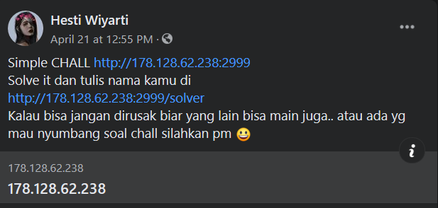
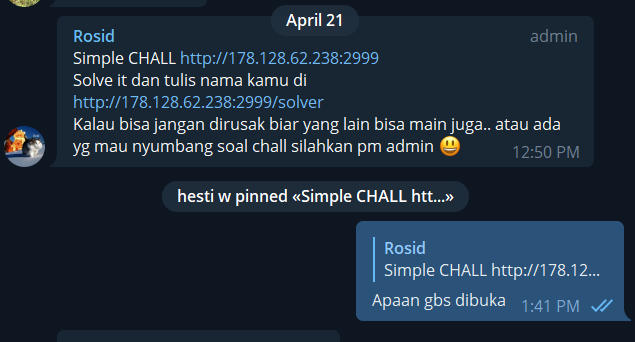
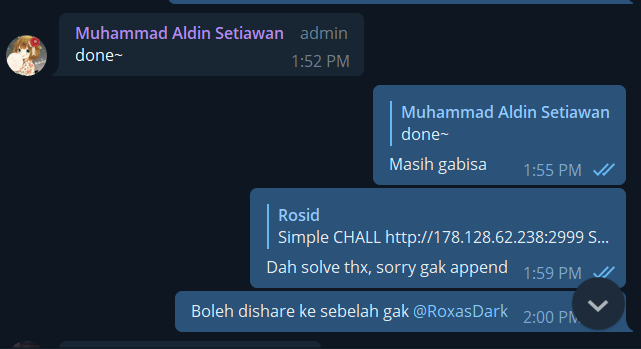
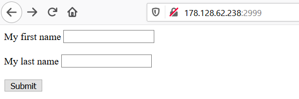
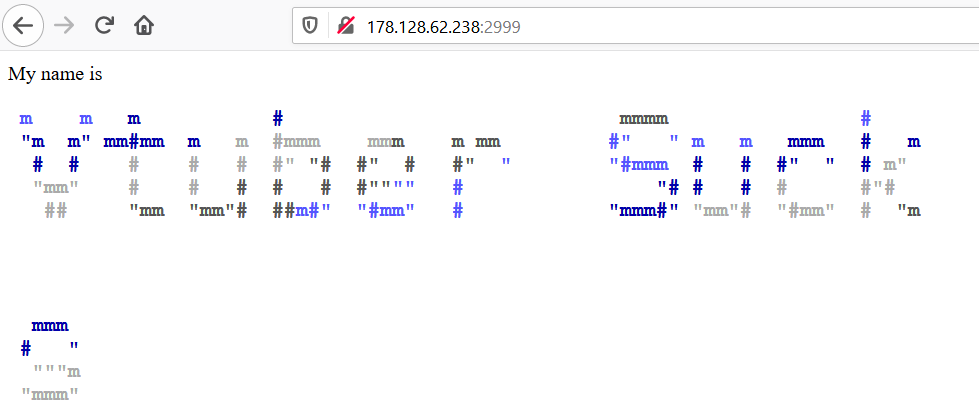
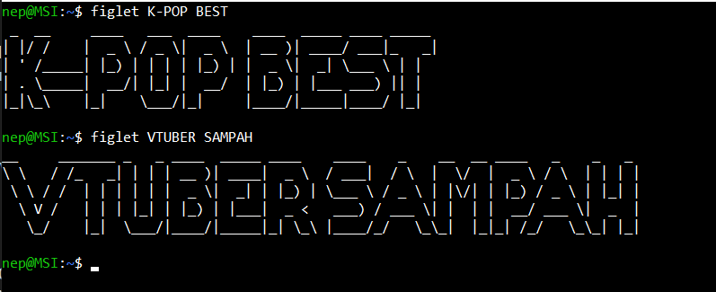
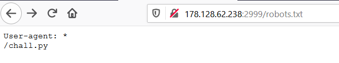

# Write UP MHL Simple Command Injection


## Prolog

Dalam sitausi pandemic Virus #COVID19 ini, Saya di Rumah saja (Tentu saja), Menjalani waktu pandemi ini, Saya ya seperti manusia no life pada umumnya. Scrolling timeline Facebook, Lalu menemukan hal menarik, Salah satu friend list saya share sebuah challenge.



Dalam hati, "Saya harus mengerjakannya". Soalnya sejak 2020 saya tidak pernah mengerjakan challenge hacking. Kebanyakan latihan Challenge Competitive Programming atau gak ngoding buat website.

Skip skip... Saya lupa ngerjain itu challenge, Karena emang lihatnya di Handphone ya jadi lupa. Lalu pas online di Laptop, Buka telegram ada notify pin dari grup `Malang Hacker Link` (Saya sendiri baru join :( ) ternyata challenge yang sama.




Nah di situ terlihat, saya tanya "Apaan gbs dibuka" ternyata emang lagi difix, Mungkin ada something **Wrong**.


### Informasi 

Saya mengerjakan challenge itu 'Cukup Lumayan cepat', Sekitar 10 menitan, Bukan karena gampang si, Tapi Challengenya familiar dan saya sudah pernah mengerjakan challenge serupa yang lebih sulit dari challenge tersebut. Tapi challenge ini mengajarkan saya beberapa hal yang akan saya lanjutkan pada bagian POC.





# Proof of Concept 

Announcement Challenge 


```
Simple CHALL http://178.128.62.238:2999
Solve it dan tulis nama kamu di 
http://178.128.62.238:2999/solver
Kalau bisa jangan dirusak biar yang lain bisa main juga.. atau ada yg mau nyumbang soal chall silahkan pm admin 😃
```

Tujuan challengenya sudah jelas, kita disuruh untuk menulis nama kita pada `route` `solver`, Dan `hit` dari `/solver` adalah `read` file `solver.txt`.

## Penampakan Challenge jika dibuka



Iya tampilannya cukup `ew sekali` ya, tanpa CSS dan hiasan lainnya. PERSIS seperti yang biasa saya dan teman-teman saya buat, Padahal teman saya ini ada yang ikut lomba LKS **Loh he? Kok gabisa CSS? Ya Mbuh**. Siapapun yang buat challenge *Tos Online*.


### Mencoba fitur

Terdapat 2 form pada challenge tersebut, First Name dan Last Name. Secara sederhana saya langsung berfikir. "Palingan gak jauh jauh dari SQLi atau Top Common Bug lainya". Ternyata diluar dugaan. Saat saya menginputkan **VTUBER SUCKS**, Muncul ouput yang menarik sebagai berikut.




Hmm, ternyata inputan direfleksikan dengan output yang Indah, Disitu saya langsung ingat salah satu utility/tools pada linux yang cukup sering muncul di-`shell` saya. Iyaa `figlet`.




Nah sejak saat itu, Mindset saya mulai berubah. "Wah ini mah command injection". Asumsinya adalah inputan saya dipassing langsung ke `figlet`.

- Asumsi Penulis

$inputan = $first+$last;

```sh
figlet $inputan
```

Karena saya sudah punya asumsi sendiri, Saya mencoba common command injection payload. Berikut listnya


```sh
;id 
|id
|&id
&&id
```

Semua dari inputan saya tersebut mendapat response block dari challenge, Pastinya difilter lah, Gamungkin segampang ini juga. Berikut responsenya.


- Asem response blocknya gak saya ss, pas dibuat dongeng ini, Webnya down :( Saya update kalau udah up.


Itunya ada gambar anime ew itu terus ada nulisan kalau gak salah `No Pipeline`


Setelah saya mendapatkan response block tersebut, saya lalu mecoba menginputkan karakter-karakter unique. Berikut listnya.


```
//'
'/./'
#/#//##/#/
*/!//!'
```

Dah mendapatkan response error yang lain seperti berikut.


Dan taraaa ada response error yang menunjukan clue yang sangat gamblang. Pada text yang saya kasih square merah. Ini yang buat wibu banget, Saya gak masalah si sama wibu, Kecuali `Tukang Sihir` Wibu laknat.


```sh
echo $inputan | toilet --html --metal
```

Sudah sangat bisa dipastikan ini adalah Command Injection. Yang mana inputan kita langsung dipassing kedalam command shell, lalu diformat dengan `toilet`

## My List Payload 

```sh
`id`
$(id)
`echo ytyao ganteng >> solver.txt
$(echo ytyao ganteng >> solver.txt)
PHP_EOL id 
PHP_EOL echo >> solver.txt
```

Diatas adalah payload yang dapat digunakan untuk menyelesaikan challenge Tersebut.


# Bonus


Bada section bonus ini saya melakukan `percobaan` setelah berhasil menulis username telegram saya pada `solver.txt`. Percobaan saya menemukan hal hal yang basic yang terlewatkan yang sudah disiapkan pembuat soal untuk memudahkan pengerjaan.


## Tahapan yang dilupakan / dilewati


Pentingnya tahapan `Reconnaissance` Sederhana yang mana seharusnya bisa memudahkan kita untuk melakukan tahapan exploitasi.


Ada sebuah `robots.txt` yang mana berisi `chall.py` (Sudah saya backup di `/src/`). Dah isi jika kita langsung membaca `chall.py` maka akan lebih mudah mengerjakan challenge tersebut.





## Vuln lain pada Challenge


Karena challenge ini mempasing semua inputan ke command shell, Kita bisa membuat local dos yang dapat menggangu kinerja server, membuat server hang tanpa respon.


Seperti menginputkan command seperti

```sh
cat -
```

Server akan mengalami hang karena harusnya server menerima `STDIN` input dari user, karena tidak ada server akan terus listen available dan waiting STDIN. Lalu command command lain seperti.


```
vim solver.txt
ping
```

Dan jika melakukan input junk sebanyak2nya sudah cukup untuk membuat server hang untuk beberapa saat, Karena akan cukup lama mengembalikan response format dari `toilet`.


## Penutup

Terima kasih pada semua pihak yang membuat challenge ini, Sudah cukup lama saya tidak main challenge2an, Saya minta maaf jika pada proses percobaan saya membuat itu challenge terganggu, Saya tidak ada maksud merusak atau menggangu. Sekali lagi terima kasih telah memberi kami (Semua yang mencoba) challenge setelah sekian lama! 

With Full Love and Respect Nikko Enggaliano